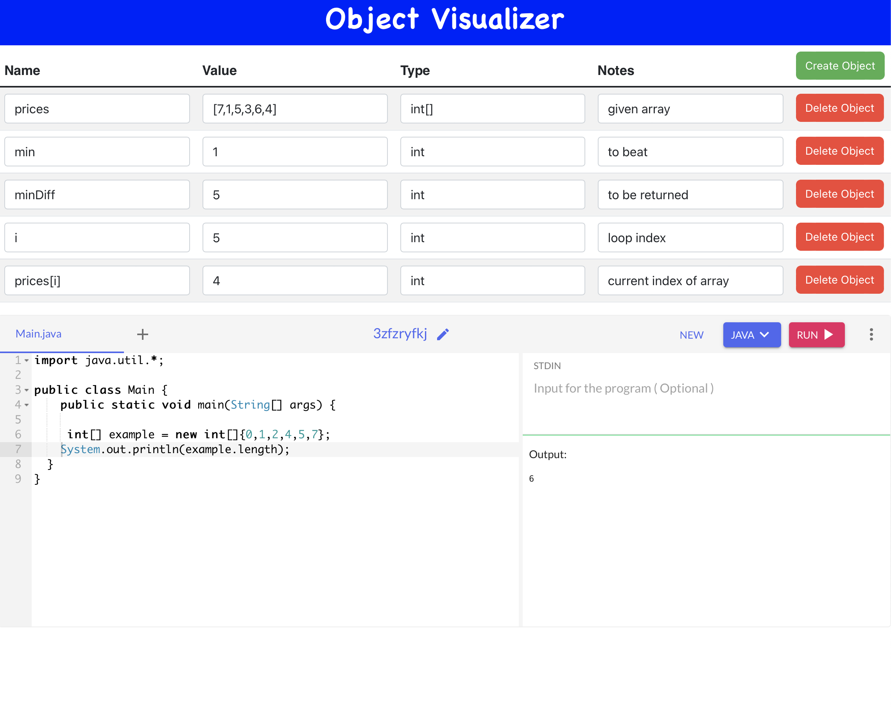

# Object Visualizer (Algorithm Debugger)

Object Visualizer, formerly known as LeetCode Bedbugger, is a web application designed to assist coders in visualizing and debugging their algorithms during loops and other iterations. It allows users to create variable names and track their corresponding types, values, and notes in a table format. This project was born out of the need for an efficient debugging tool during coding challenges and projects. While previously using Google Docs for this process, the realization that a more specialized and streamlined solution was required led to the development of Object Visualizer.

## Features

1. **Variable Table**: Object Visualizer provides a dynamic table where users can add and delete rows. Each row represents a variable and contains columns for the variable name, type, value, and notes. This feature allows coders to keep track of different variables and their states during code execution.

2. **Interactive Code Testing**: The application integrates an iframe from OneCompiler, a powerful online compiler and IDE. This integration allows users to test code snippets in various programming languages directly within the Object Visualizer interface. The real-time feedback from the compiler assists users in debugging their code efficiently.

3. **Material UI and Bootstrap Integration**: Object Visualizer utilizes Material UI and Bootstrap to ensure a polished and responsive user interface. Material UI components enhance the visual appeal and interactivity of the application, while Bootstrap provides a responsive layout suitable for various devices.

4. **RSuite Table Component**: The variable table in Object Visualizer is built using the RSuite library, which offers feature-rich and customizable table components. RSuite provides a seamless and user-friendly experience for managing variables during code execution.

## Getting Started

To use Object Visualizer on your local machine, follow these steps:

### Prerequisites

- Node.js and npm installed on your machine.

### Installation

1. Clone the repository:

```bash
git clone https://github.com/your-username/object-visualizer.git
```

2. Navigate to the project directory:

```bash
cd object-visualizer
```

3. Install the required dependencies:

```bash
npm install
```

### Usage

1. Start the application:

```bash
npm start
```

2. Access Object Visualizer by opening your web browser and visiting `http://localhost:3000`.

3. Use the "Add Row" button to create new variable entries in the table. Fill in the variable name, type, value, and notes for each entry.

4. Use the "Delete Row" button to remove any unnecessary or redundant rows.

5. To test code snippets in different programming languages, enter the code in the iframe from OneCompiler and select the desired language from the dropdown menu.

6. Save, export, or share your variable table with others by using the corresponding options in the application.

### License

This project is licensed under the MIT License - see the [LICENSE](LICENSE) file for details.

## Demo Screenshot

<p align="center">
  
</p>

---

Object Visualizer, formerly known as LeetCode Bedbugger, aims to simplify code visualization and debugging for coders. As a former user of Google Docs for this purpose, the realization that a specialized tool could significantly improve the workflow led to the development of Object Visualizer. It is our hope that this application will not only enhance the coding experience for ourselves but also prove helpful to other coders and developers in their coding endeavors. The README provides an overview of the application's features, installation instructions, usage guidelines, and details about the included dependencies: Material UI, Bootstrap, and RSuite. Remember to replace placeholders like "your-username" with your actual GitHub username, and "demo/demo.png" with the correct file path to the demo screenshot. If you have any further questions or need additional assistance, feel free to ask. Happy coding!
